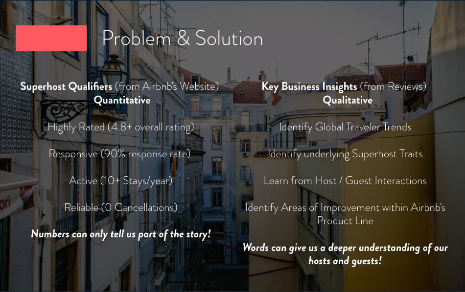
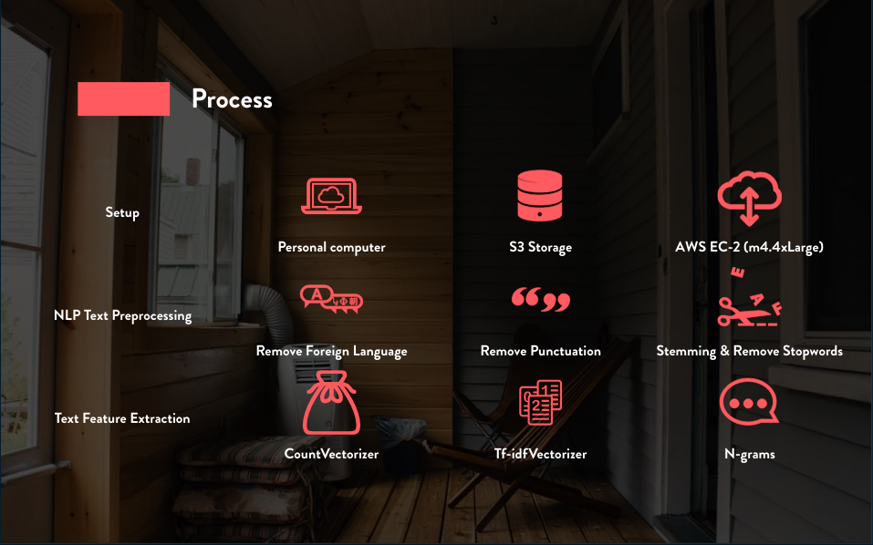
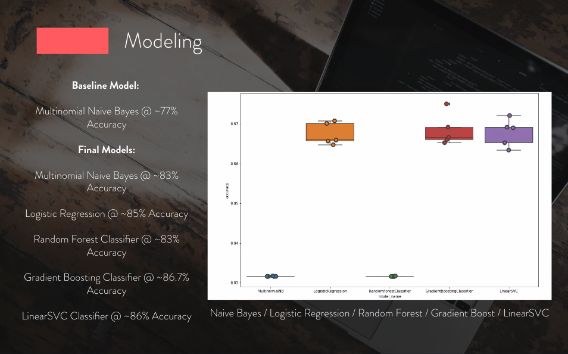
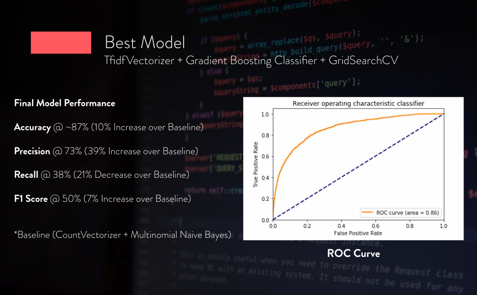
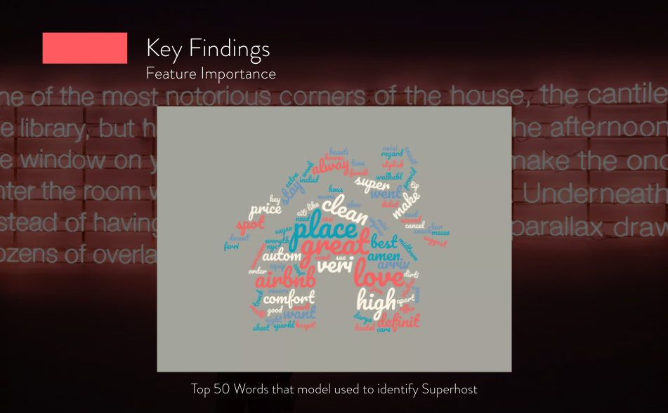

### Objective

#### Create a classifier to determine if someone is a Superhost or not for Airbnb listings based on reviews

### Problem & Solution (Key Business Insights)
 

### Dataset

### Process & Setup

### Modeling

### Results

### Feature Importance

### False Positive Example

This false positive is an example of others who are missed by airbnb's current superhost system. This person below has 5+ star rating, 63+ great reviews, and has priced her listing considerably lower than her superhost counterparts within the same neighborhood. She would be counted as a great deal for bargain hunters looking for an airbnb to stay at in New York. The other business insight from this specific listing is that we can reach out to her, offering pointers on how to get her to superhost status. Superhosts typically get featured ads on airbnb's website, generate more revenue, and get special perks such as coupon certificates to use at other airbnb listings.

### Conclusion

This project was a very interesting dive into reviews and how we can use them to help find insights for both business applications as well as research purposes. Through this project, I was able to learn many things such as seting up a cloud computing server to run my models, cleaning text, featurizing text, and extracting other information from text data. I was able to grow and stengthen my NLP & modeling skills as well as develop business insights. Overall I would like to think this project was a sucess as I was able to idenfity Superhost from regular host with a ~86.7% accuracy.

### Sources
*Thanks to the following websties & packages!*

* [insideAirbnb Dataset](http://insideairbnb.com/)
* [langdetect Package for Python (Very Handy in Identifying Foreign Language)](https://github.com/Mimino666/langdetect)
